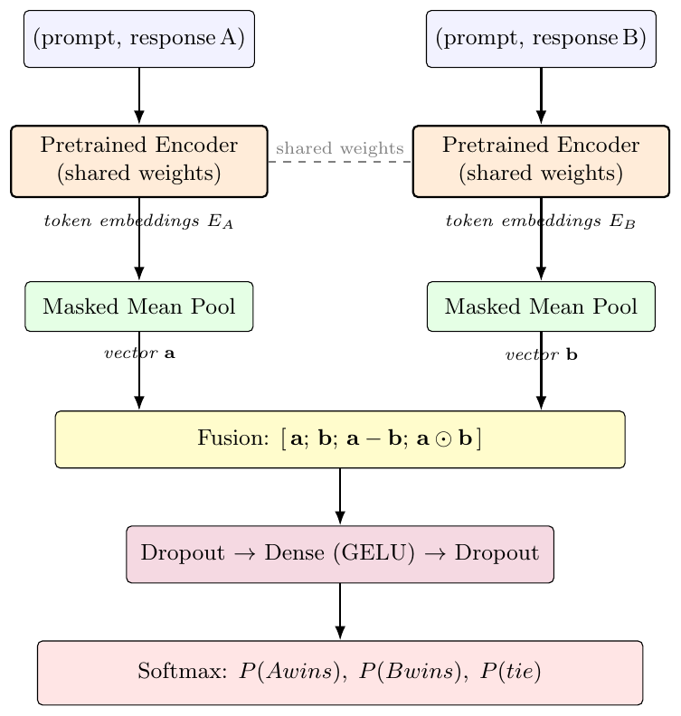
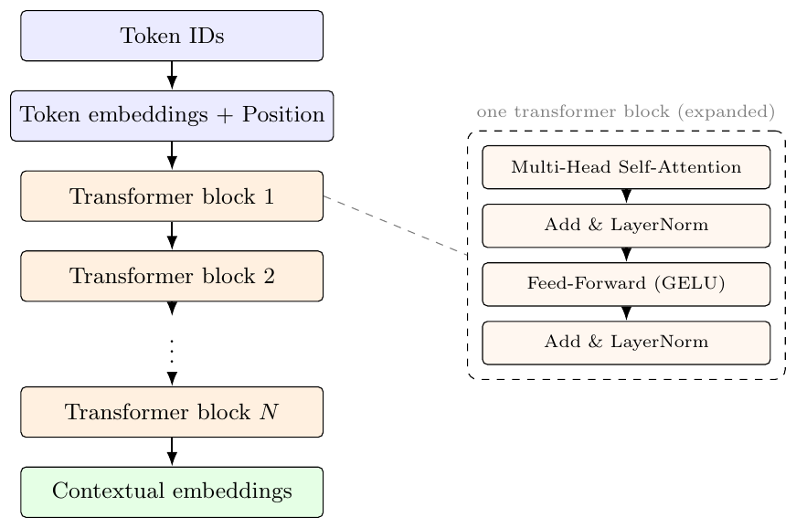
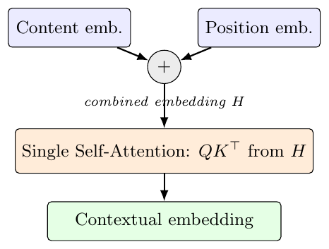
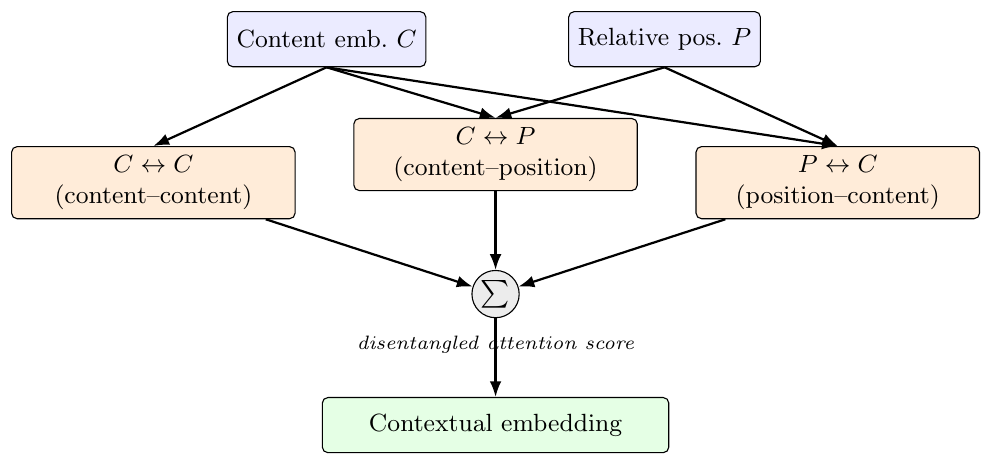
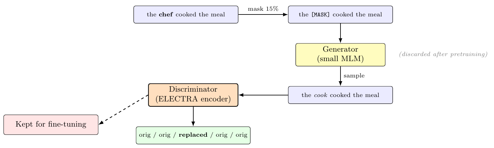

# llm-preference-classification
Fine-tuning and comparing DeBERTa-v3, RoBERTa, and ELECTRA on the Chatbot Arena human-preference task with the shared Siamese architecture.
# Predicting Human Preferences in LLM Responses

A comparative study of three pretrained transformer encoders — **DeBERTa-v3-xs**, **RoBERTa-base**, and **ELECTRA-large** — fine-tuned with a shared Siamese architecture on the Kaggle [*LLM Classification Finetuning*](https://www.kaggle.com/competitions/llm-classification-finetuning) competition.

The task: given a prompt and two anonymous LLM responses, predict which response a human will prefer (three classes: `model_a` wins, `model_b` wins, or tie). Submissions are scored on multi-class log loss.

---

## Repository contents

```
.
├── llm-classification-finetuning-deberta.ipynb   # DeBERTa-v3-xs experiment
├── llm-classification-finetuning-roberta.ipynb   # RoBERTa-base experiment
├── llm-classification-finetuning-electra.ipynb   # ELECTRA-large experiment
├── figs/                                         # Architecture diagrams
├── report.pdf                                    # Full write-up
└── README.md
```

Each notebook is self-contained and runs on a single Kaggle GPU (P100 or T4).

---

## Data

The competition releases preference judgements from [Chatbot Arena](https://chat.lmsys.org), a platform where users vote on responses from two anonymous LLMs (GPT-4, GPT-3.5, Llama-2, Koala, Mistral, etc.).

- **57,477** training rows, **9** columns
- Each row: `prompt`, `response_a`, `response_b`, `model_a`, `model_b`, and three binary outcome columns (`winner_model_a`, `winner_model_b`, `winner_tie`)
- Responses are often long (hundreds to thousands of characters) and include code, math, and occasional non-English text

### Preprocessing

1. Collapse whitespace, strip non-ASCII characters
2. For each row, build two paired strings: `(prompt, response_a)` and `(prompt, response_b)`
3. Collapse the three binary outcome columns into a single label in `{0, 1, 2}`
4. Stratified 90/10 train/validation split

---

## Architecture: Siamese network with shared encoder

The same pretrained encoder, with the **same weights**, processes both (prompt, response) pairs. The two embedding sequences are pooled to vectors `a` and `b`, then fused with their difference and element-wise product before classification.

<p align="center">
  
</p>

**Why Siamese.** Both inputs are objects of the same type (a prompt-response pair), so weight sharing forces them through the same representational lens and lets `a − b` and `a ⊙ b` carry meaningful comparison signal. The fusion `[a; b; a−b; a⊙b]` is the standard recipe from the InferSent / sentence-BERT line of work — concatenation alone leaves the head to learn the comparison from scratch.

**Training (all three models).** AdamW, weight decay 0.01, categorical cross-entropy with label smoothing (ε = 0.1), early stopping on validation loss, LR reduction on plateau, up to 10 epochs.

---

## Backbones compared

All three backbones are stacks of standard transformer encoder blocks and share the same high-level shape — token embeddings, then $N$ transformer blocks, then contextual outputs:

<p align="center">
  
</p>

They differ in size, in *how* attention is computed (DeBERTa), and in *how* they were pretrained (ELECTRA).

### Architectural specs

| Property | DeBERTa-v3-xs | RoBERTa-base | ELECTRA-large |
|---|---:|---:|---:|
| Transformer layers | 12 | 12 | 24 |
| Hidden size | 384 | 768 | 1,024 |
| Attention heads | 6 | 12 | 16 |
| Per-head dim | 64 | 64 | 64 |
| FFN intermediate | 1,536 | 3,072 | 4,096 |
| Vocabulary | 128,000 | 50,265 | 30,522 |
| Max position embeddings | 512 | 512 | 512 |
| Tokeniser | SentencePiece (BPE) | Byte-level BPE | WordPiece |
| **Backbone params** | ~22M | ~86M | ~335M |
| **Embedding params** | ~48M | ~39M | ~31M |
| **Total params** | **~70M** | **~125M** | **~335M** |
| Pretraining objective | RTD | Dynamic MLM | RTD (discriminator) |

> RTD = replaced-token detection (the ELECTRA-style objective that DeBERTa-v3 also adopted).

### What's distinctive about each model

**RoBERTa-base.** Standard BERT-style architecture. Content and position embeddings are summed at the input layer, and attention operates on the combined vector — one attention term, one source.

<p align="center">
  
</p>

**DeBERTa-v3-xs.** *Disentangled attention*: content and relative-position embeddings are kept separate, and the attention score between two tokens is the sum of **three** components — content↔content, content↔position, and position↔content. Position↔position is omitted. This gives the model a cleaner signal about token positions and is the main reason DeBERTa punches above its weight at a given parameter count.

<p align="center">
  
</p>

**ELECTRA-large.** Architecturally identical to BERT at the block level. The distinguishing feature is its *pretraining scheme*: a small generator proposes replacements for masked tokens, and a larger discriminator is trained to identify which tokens were replaced. Applying the loss to *every* token (rather than just the 15% masked ones, as in MLM) is the source of ELECTRA's well-known sample efficiency. After pretraining the generator is discarded; only the discriminator is used for fine-tuning.

<p align="center">
  
</p>

---

## Results

### Validation performance

| Backbone | Val. log loss | Val. accuracy | Best epoch |
|---|---:|---:|---:|
| DeBERTa-v3-xs | 1.0597 | 0.454 | 8 |
| **RoBERTa-base** | **1.0492** | **0.464** | **2** |
| ELECTRA-large | 1.0974 | 0.349 | — |
| *Uniform baseline (log 3)* | *1.0986* | *0.333* | *—* |

RoBERTa-base achieved the lowest validation log loss, slightly ahead of DeBERTa-v3-xs despite being four times larger by backbone parameter count. ELECTRA-large did not converge under the chosen training regime — its validation loss stayed essentially at the random baseline.

### Predicted probabilities on the test set

The competition submission format is exactly this: per-class probabilities for each test id. Here is what each model predicted for the same three test examples:

| Test id | Model | P(A wins) | P(B wins) | P(tie) |
|---|---|---:|---:|---:|
| 136060 | DeBERTa-v3-xs | 0.267 | 0.234 | **0.499** |
| 136060 | RoBERTa-base | 0.033 | **0.814** | 0.153 |
| 136060 | ELECTRA-large | 0.349 | 0.335 | 0.316 |
| 211333 | DeBERTa-v3-xs | **0.363** | 0.335 | 0.302 |
| 211333 | RoBERTa-base | 0.298 | **0.352** | 0.349 |
| 211333 | ELECTRA-large | 0.349 | 0.335 | 0.316 |
| 1233961 | DeBERTa-v3-xs | **0.412** | 0.299 | 0.289 |
| 1233961 | RoBERTa-base | 0.227 | **0.470** | 0.303 |
| 1233961 | ELECTRA-large | 0.349 | 0.335 | 0.316 |

> Bold = argmax class. Each row sums to 1 up to rounding (final layer is softmax over 3 classes).

Three things jump out:

- **DeBERTa and RoBERTa disagree.** On test id 136060, DeBERTa picks "tie" at P = 0.50 while RoBERTa picks "B wins" at P = 0.81 — same input, completely different reading.
- **RoBERTa's distributions are sharper.** It commits more strongly to a single class. Log loss heavily rewards sharp predictions when they're right and heavily punishes them when wrong (a confidently wrong P = 0.81 costs −log(0.19) ≈ 1.66 on that example, vs ~0.31 for DeBERTa's more cautious P = 0.27).
- **ELECTRA outputs the identical distribution `(0.349, 0.335, 0.316)` for all three test examples.** It never moved away from a constant prediction during training, so it produces the same output regardless of input. The probabilities themselves correspond to the empirical class frequencies in the training set — exactly the constant prediction a classifier reduces to when it can't extract signal from its inputs.

### Why ELECTRA failed

A classic cold-start problem for large pretrained transformers: with a randomly initialised classification head and a learning rate too low to move the backbone away from its pretrained state, the gradients are insufficient to drag the model into a task-specific configuration. The model has more than enough capacity; it just wasn't given a schedule that let the head and backbone train together. Standard fixes:

- **Linear LR warmup** over the first ~10% of steps
- **Higher peak LR** (3e-5 to 5e-5 for a model this size, vs the 1e-5 used)
- **Head-only warmup phase** before unfreezing the backbone

### Takeaways

- Model size is not a reliable predictor of performance on this task. The smallest model (DeBERTa-v3-xs, 22M backbone params) is competitive with one 4× its size, and the largest fails outright.
- All three working models settle into validation log losses in a narrow band (1.04–1.06), only modestly better than the random baseline (1.099). Human preferences over LLM responses are inherently noisy, and the Siamese formulation — which never lets the encoder attend *across* the two responses — leaves headroom no choice of backbone within this family can recover.
- ELECTRA's failure is an optimisation issue, not a representational one.

---

## Future work

- **Cross-encoder formulation.** Concatenate prompt and both responses into one sequence and let self-attention compare them directly during encoding. Stronger inductive bias than Siamese for preference tasks.
- **Longer sequence length** (384–512 tokens) to capture more of each response.
- **Multilingual backbone** (XLM-RoBERTa, mDeBERTa) so the non-ASCII filtering step can be removed.
- **Reward-model initialisation.** Start from a model already fine-tuned for human preferences (e.g. `OpenAssistant/reward-model-deberta-v3-large-v2`) instead of from a vanilla language encoder.

---

## References

- Chiang et al. — [Chatbot Arena: An Open Platform for Evaluating LLMs by Human Preference](https://arxiv.org/abs/2403.04132), 2024
- He, Gao, Chen — [DeBERTaV3: Improving DeBERTa using ELECTRA-Style Pre-Training](https://arxiv.org/abs/2111.09543), 2021
- Liu et al. — [RoBERTa: A Robustly Optimized BERT Pretraining Approach](https://arxiv.org/abs/1907.11692), 2019
- Clark, Luong, Le, Manning — [ELECTRA: Pre-training Text Encoders as Discriminators Rather Than Generators](https://openreview.net/forum?id=r1xMH1BtvB), ICLR 2020
- Bromley, Guyon, LeCun et al. — Signature Verification using a "Siamese" Time Delay Neural Network, NeurIPS 1993
- Conneau et al. — [Supervised Learning of Universal Sentence Representations from Natural Language Inference Data](https://arxiv.org/abs/1705.02364), EMNLP 2017

See [`report.pdf`](report.pdf) for the full write-up with discussion.
